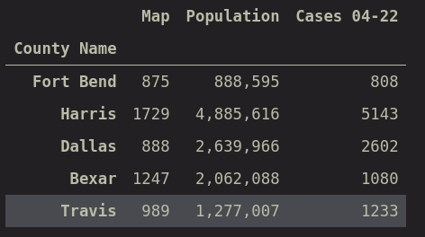
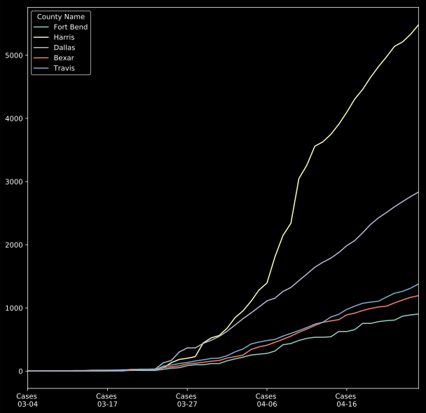
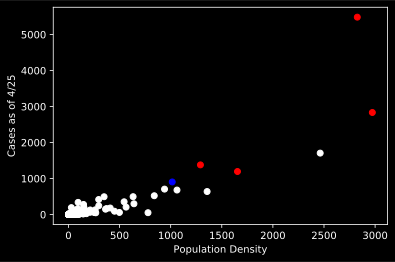
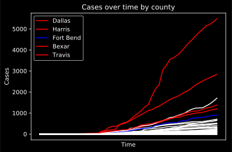
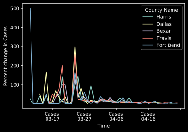

## Background

One of my friends on social media recently shared a post by one of our local politicians (currently a sherrif):

>Lina Hildago announced a countywide mandate for Harris County residents 10 or older to wear face masks at all times in public or be fined $1,000. Well, not in Ft. Bend County. We will not trample on the individual rights of Texans to provide a false sense of security. I have 826 staff at the Ft. Bend Sheriff’s Office. We interact with the public daily. In 3 months, I’ve had just 2 officers test positive. I have over 800 inmates and staff in the jail and not a single positive test. NOT ONE. No one’s been hospitalized. I encourage people to wear a mask if they have one, I encourage people to wash their hands frequently, I encourage people to do the right thing to help protect our most vulnerable, but this government MANDATE from Harris County is unnecessary, unconstitutional, and unAmerican. It’s an unprecedented overreach which looks more like a communist dictatorship than a free Republic. At this point, I see it as nothing more than politics. Governor Abbott announces a trajectory to start reopening Texas and Harris County, which never even utilized its $60 MILLION pop up hospital at NRG, implements a mandate for face masks on 4 million people. The other counties to do it are Dallas, Bexar, and Travis. These are the 3 most liberal counties in the state of Texas. Coincidence? I don’t think so. I believe we’ve seen the worst of this war. And we’re closer to victory than we’ve ever been. Let’s keep doing our part to be conscious of others when we’re out and make sure to hold government accountable, always.

This stood out to me in that several of the statements made here could be _easily_ proven to be certifiably false, regardless of your political leanings.

> Harris County, which never even utilized its $60 MILLION pop up hospital at NRG, implements a mandate for face masks on 4 million people.

It turns out, the real number is about [$17 million][1]. Nothing to shake a twig at, but understandable given that the county was trying to be prepared in the case that hospitals were overrun. We have so far lucked out in that the expenditure has not been necessary. Even in the worst case scenario that the full $60 million would have been necessary, [Channel 2 also quoted officials as saying that the federal government would reimburse Harris up to 75%][2], thus capping expenditures at $25 million.

Further still, he makes a comment about three other counties in Texas that have employed mandates for masks similar to Harris:

>The other counties to do it are Dallas, Bexar, and Travis. These are the 3 most liberal counties in the state of Texas. Coincidence? I don’t think so.

Political commentary aside, this statement prompted my curiosity to investigate how the four counties mentioned by this politician may stand out in ways other than just their political leanings - which led to this very quick and dirty exploration of COVID-19 data.

## Data Sources

For this project I wanted to ensure that I utilized relevant data sources, so I pulled the current county-level data from the [Texas HHS website][3]. Upon exploration of the data I found that it lacked a feature for the area of the county, so I also scraped the data from the wikipedia page for the [counties in Texas][4] as well. This provided me with enough data to explore the evolution of the number of cases since the state health department started tracking it, the population, and the area for each of Texas' counties.

## Cleaning

Cleaning luckily was relatively straightforward. The HHS data needed to have the extraneous information not related to the data removed, and [converted to a csv](./texascases.csv). The county area data, however, took a bit more work due to the copy-paste method used in lieu of building a scraper using `requests` and `beautifulsoup`. Cleaning the pasted data consisted mostly of ensuring that no rows were left out and manually filling in a few values on several rows. NaN's and missing values were checked using pandas before moving on to the exploration step.

## Exploration and Analysis

In the first few steps we are able to zero into the high-level summary information for the four counties in question in addition to Fort Bend:

Note: in this dataset Map refers to the area in square miles.

Immediately we can see that in terms of total number of cases on the date that the comment was made, Fort Bend has significantly fewer cases than all of the other counties. The fact that there are about 800 cases also resonates with something interesting that the politician had stated early in his post:

> I have 826 staff at the Ft. Bend Sheriff’s Office. We interact with the public daily. In 3 months, I’ve had just 2 officers test positive. I have over 800 inmates and staff in the jail and not a single positive test.

With 826 staff and 800 inmates, it is _highly statistically unlikely_ that many, if any at all, would contract the disease. Considering officers tend to have a higher-than-normal frequency of interaction with individuals, and inmates have considerably lower-than-normal frequency of interaction, one would expect values in this range. For a more robust analysis, we could conduct a monte-carlo simulation of exposure, or even more simply conduct a statistical test to guage whether the population of staff contracting at a rate of 2/826 is signficantly different than what we would expect.

We should be cautious making observations in terms of absolute numbers and thus in this next section we begin to explore the rates of the number of cases as well as population density. Case rates are important because the help us to compare across the different regions to understand how rampant the disease is relative to the size of the population in that area. We also want to explore population density, as it has a dramatic effect on the expansion of the disease - with areas that are more dense having a more rapid spread. In the table below we find the previous summary data with the case rate (cases/population) and the population density (population/area).

| County Name   |   Area (sq. mi) |       Population |   Cases 04-22 |        Case Rate |   Pop. Density |
|:--------------|------:|-----------------:|---------:|------------:|----------:|
| Fort Bend (Houston Suburbs)     |   875 | 888595           |      808 | 0.000909301 |   1015.54 |
| Harris (Houston)       |  1729 |      4885616 |     5143 | 0.00105268  |   2825.69 |
| Dallas        |   888 |      2639966 |     2602 | 0.000985619 |   2972.93 |
| Bexar (San Antonio)         |  1247 |      2062088 |     1080 | 0.000523741 |   1653.64 |
| Travis (Austin)       |   989 |      1277007 |     1233 | 0.000965539 |   1291.21 |

The case rate for Fort Bend is about on-par with several of the other areas. There may be a modicum of truth in this post after all! However, we can see that the population density of Fort Bend is significantly lower than the other four counties in this table, with the closest being Travis County which has almost a 28% higher density. Additionally, the calculated pearson correlation between the number of cases on the last day of data (4/25) and the population density comes out to 0.88, which indicates a strong positive linear behavior. These significantly higher densities potentiate higher risk factors to the population, which we ideally should see borne out through several other areas of our data.

Tracking the total number of reported cases over time, we can see that Fort Bend not only has fewer cases, but also has not accelerated to the degree that Dallas and Harris have. We can see that the number of cases seem to cluster by their population density. Studying a scatter plot of all the counties of Texas with their number of cases vs population density:

Does show that these groups do have a tendancy to form in the same area, but there are hardly enough data points to describe this as a cluster. The scatter plot does, however exhibit linear behavior, as expected from the relatively high correlation discussed previously. Given the behavior of the points in the plot, it may be worth keeping an eye on several of the other points that were not mentioned by the politician by name:

| County Name   | Cases    | Population Density        | color   |
|:--------------|-----:|---------:|:--------|
| Bexar         | 1195 | 1653.64  | red     |
| Collin        |  639 | 1356.6   | white   |
| Dallas        | 2834 | 2972.93  | red     |
| Denton        |  680 | 1061.96  | white   |
| El Paso       |  706 |  940.144 | white   |
| Fort Bend     |  905 | 1015.54  | blue    |
| Harris        | 5482 | 2825.69  | red     |
| Tarrant       | 1706 | 2462.79  | white   |
| Travis        | 1379 | 1291.21  | red     |

Given these results, we may want to look towards Collin (North of Dallas), Denton (North of Dallas), El Paso, and Tarrant (Fort Worth) counties in the near term as being higher risk-factor counties. It should be noted that with regards to the politician's comment, these counties voted 55.62%, 57.13%, 25.94%, and 51.74% in favor of Donald Trump during the [2016 presidential election][5]. There may be some truth to this statement yet! El Paso presents an interesting exception to the statement due to its vastly different demographics in comparison to the others in this grouping. 

Evaluating the number of cases across all counties in Texas paints a similar picture, with four of the largest five counties by number of cases falling into the category of having mandates for the use of face masks. It should again be noted that Tarrant County again falls into the regime of the larger number of cases, and should be monitored closely in the coming weeks.

Finally, I'd like to unpack the last few comments that the politician made about the "worst being over":

> I believe we’ve seen the worst of this war. And we’re closer to victory than we’ve ever been.

In most cases for a statistical analysis (not necessarily an epidemiological one) we would describe the beginning of the worst being over when a trend is in a reversal pattern - that is, when the _rate of growth_ has begun to reach a negative number. In the next figure, we see that the percent change in the number of cases day-to-day has declined precipitously over the period. This is likely a result of the social distancing measures implemented by all of these counties in an effective way. This could also be caused by a lack of testing, which would additionally yield a lower total case count. 

**However**, inspection of the data at the end of the time period shows the rate of growth has not achieved a negative value, nor even zero. This means that while we currently don't expect an increasing acceleration of the number of cases, we should expect to see the number continue to grow. It appears that for most counties the rate is tapering off at a 2 - 3% growth, which is incredibly dangerous when considering the size of major counties in Texas. It is more dangerous still considering that this is _with social distancing measures currently in place_. One can only expect that the rate of growth to increase in the event that the policies that we have enforced up until now are relaxed. Areas such as Harris, Dallas, and Tarrant would be considered dangerous places to be in the event that growth rates increased at an exponential pace.

|        |    Harris |    Dallas |     Bexar |    Travis |   Fort Bend |
|:-------|----------:|----------:|----------:|----------:|------------:|
| 04-21 | 0.0319303 | 0.0345964 | 0.0137931 | 0.0595668 |   0.0204342 |
| 04-22 | 0.0333534 | 0.035828  | 0.0495627 | 0.0502555 |   0.0112641 |
| 04-23 | 0.0132219 | 0.0311299 | 0.0425926 | 0.0243309 |   0.0767327 |
| 04-24 | 0.0228363 | 0.0298174 | 0.0364121 | 0.0387965 |   0.0218391 |
| 04-25 | 0.0285178 | 0.0256967 | 0.0239931 | 0.0510671 |   0.0179978 |

## Concessions

This is most certainly back-of-the-envelope calculations and frankly some of the messiest code I've ever written. However, if I can poke holes in these ideas with no scientific rigor, it is likely that the comment from this politician contains other mistakes. Additionally, the data sources I have utilized have a time mismatch: the spatial data comes from the National Association of Counties archive from 2007, and the estimates for the land area may have changed since then.

## Future Studies 

Definitely keeping an eye on Tarrant county to see if they adopt a mask regulation in the coming weeks will be an interesting next step for this study. As Texas inches closer to relaxing distancing policies, it will be interesting to see which areas have the largest increases in the number of cases as a result of re-establishing norms. 

[1]: https://www.click2houston.com/news/local/2020/04/23/investigates-conversations-underway-to-dismantle-costly-temporary-hospital-at-nrg-park/
[2]: https://www.click2houston.com/news/local/2020/04/07/a-medical-shelter-is-being-built-at-nrg-park-a-source-says-heres-what-we-know-about-it/
[3]: https://txdshs.maps.arcgis.com/apps/opsdashboard/index.html#/ed483ecd702b4298ab01e8b9cafc8b83
[4]: https://en.wikipedia.org/wiki/List_of_counties_in_Texas
[5]: https://en.wikipedia.org/wiki/2016_United_States_presidential_election_in_Texas